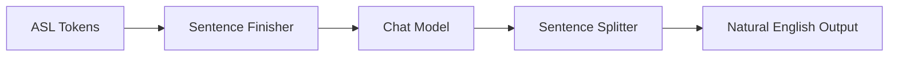

# SignGPT-Crew-Server 🤖🤟

[](https://www.python.org/downloads/)
[](https://fastapi.tiangolo.com/)
[](https://github.com/joaomdmoura/crewAI)
[](LICENSE)

> **AI-powered American Sign Language (ASL) token processing server using multi-agent workflows**

SignGPT-Crew-Server is a FastAPI-based REST API that processes American Sign Language (ASL) tokens and converts them into natural English sentences using specialized AI agents powered by CrewAI and OpenAI GPT models.

## 🌟 Features

- **🚀 FastAPI REST API** - Modern, fast web API with automatic OpenAPI documentation
- **🤟 ASL Token Processing** - Convert ASL token sequences to natural English sentences
- **🤖 Multi-Agent Workflow** - Specialized AI agents for different processing steps
- **✅ Token Validation** - Validate input tokens against comprehensive ASL vocabulary dataset
- **❤️ Health Monitoring** - Built-in health check and system status endpoints
- **🔧 Developer Friendly** - Auto-reload, comprehensive docs, type hints
- **🌐 CORS Ready** - Configured for web frontend integration
- **📊 Comprehensive Dataset** - 2000+ ASL vocabulary tokens included

## 🏗️ Architecture

The system uses a multi-agent approach with three specialized AI agents:

1. **Sentence Finisher Agent** - Converts ASL tokens to grammatical English
2. **Chat Model Agent** - Provides conversational responses constrained by ASL vocabulary
3. **Sentence Splitter Agent** - Handles English-to-ASL conversion and token reordering



## 🚀 Quick Start

### Prerequisites

- Python 3.11 or higher
- OpenAI API key
- [uv](https://docs.astral.sh/uv/) (recommended) or pip

### 1. Clone the Repository

```bash
git clone https://github.com/your-username/SignGPT-Crew-Server.git
cd SignGPT-Crew-Server
```

### 2. Install Dependencies

**Using uv (recommended):**

```bash
uv sync
```

**Using pip:**

```bash
pip install -r requirements.txt
```

### 3. Configure Environment

```bash
# Copy the example environment file
cp .env.example .env

# Edit .env and add your OpenAI API key
echo "OPENAI_API_KEY=your_openai_api_key_here" > .env
```

### 4. Start the Server

**Using the startup script (recommended):**

```bash
python start_server.py
```

**Or directly with uvicorn:**

```bash
uvicorn app:app --host 0.0.0.0 --port 8000 --reload
```

### 5. Access the API

Once the server is running, you can access:

- **🏠 Root**: http://localhost:8000/
- **📚 Interactive API Docs**: http://localhost:8000/docs
- **📖 Alternative Docs**: http://localhost:8000/redoc
- **❤️ Health Check**: http://localhost:8000/health

## 📚 API Reference

### Core Endpoints

#### `POST /process-tokens`

Process ASL tokens through the AI agent workflow to generate natural English sentences.

**Request:**

```json
{
  "words": ["YOU", "NAME", "WHAT"]
}
```

**Response:**

```json
{
  "result": "What is your name?"
}
```

**Example:**

```bash
curl -X POST "http://localhost:8000/process-tokens" \
  -H "Content-Type: application/json" \
  -d '{"words": ["TOMORROW", "SCHOOL", "GO", "I"]}'
```

#### `GET /health`

Check server health and configuration status.

**Response:**

```json
{
  "status": "healthy",
  "message": "Service is running",
  "asl_dataset_size": 2000
}
```

#### `GET /asl-dataset`

Get information about the available ASL vocabulary dataset.

**Response:**

```json
{
  "total_words": 2000,
  "sample_words": ["A", "ABLE", "ABOUT", "ABOVE", ...],
  "description": "Available ASL vocabulary tokens"
}
```

#### `POST /validate-tokens`

Validate if given tokens exist in the ASL dataset.

**Request:**

```json
["YOU", "INVALID_TOKEN", "NAME"]
```

**Response:**

```json
{
  "validation_results": {
    "YOU": { "valid": true, "normalized": "YOU" },
    "INVALID_TOKEN": { "valid": false, "normalized": null },
    "NAME": { "valid": true, "normalized": "NAME" }
  },
  "summary": {
    "total_tokens": 3,
    "valid_count": 2,
    "invalid_count": 1,
    "valid_tokens": ["YOU", "NAME"],
    "invalid_tokens": ["INVALID_TOKEN"]
  }
}
```

## 💡 Usage Examples

### Python Client

```python
import requests

# Initialize client
base_url = "http://localhost:8000"

# Process ASL tokens
def process_asl_tokens(tokens):
    response = requests.post(
        f"{base_url}/process-tokens",
        json={"words": tokens}
    )
    if response.status_code == 200:
        return response.json()["result"]
    else:
        print(f"Error: {response.status_code} - {response.text}")
        return None

# Examples
examples = [
    ["YOU", "NAME", "WHAT"],
    ["TOMORROW", "SCHOOL", "GO", "I"],
    ["COFFEE", "LIKE", "YOU"],
    ["HELP", "NEED", "I"]
]

for tokens in examples:
    result = process_asl_tokens(tokens)
    print(f"Input: {tokens}")
    print(f"Output: {result}\n")
```

### JavaScript Client

```javascript
// Process ASL tokens
async function processASLTokens(tokens) {
  try {
    const response = await fetch("http://localhost:8000/process-tokens", {
      method: "POST",
      headers: {
        "Content-Type": "application/json",
      },
      body: JSON.stringify({ words: tokens }),
    });

    if (!response.ok) {
      throw new Error(`HTTP error! status: ${response.status}`);
    }

    const data = await response.json();
    return data.result;
  } catch (error) {
    console.error("Error processing tokens:", error);
    return null;
  }
}

// Example usage
const tokens = ["YOU", "NAME", "WHAT"];
processASLTokens(tokens).then((result) => {
  console.log(`Input: ${tokens.join(" ")}`);
  console.log(`Output: ${result}`);
});
```

### cURL Examples

```bash
# Basic token processing
curl -X POST "http://localhost:8000/process-tokens" \
  -H "Content-Type: application/json" \
  -d '{"words": ["HELLO", "MY", "NAME", "SIGN", "J", "O", "H", "N"]}'

# Health check
curl "http://localhost:8000/health"

# Get dataset info
curl "http://localhost:8000/asl-dataset"

# Validate tokens
curl -X POST "http://localhost:8000/validate-tokens" \
  -H "Content-Type: application/json" \
  -d '["HELLO", "WORLD", "INVALID_TOKEN"]'
```

## 🔧 Development

### Project Structure

```
SignGPT-Crew-Server/
├── app.py                 # FastAPI application
├── start_server.py        # Server startup script
├── main.py               # Original CLI interface
├── crew.py               # CrewAI agent definitions
├── tools.py              # Custom tools (if any)
├── config/
│   ├── agents.yaml       # Agent configurations
│   └── tasks.yaml        # Task definitions
├── data/
│   └── english_words.json # ASL vocabulary dataset
├── .env.example          # Environment template
├── pyproject.toml        # Project configuration
└── README.md            # This file
```

### Environment Variables

Create a `.env` file with the following variables:

```bash
# Required
OPENAI_API_KEY=your_openai_api_key_here

# Optional
OPENAI_MODEL_NAME=gpt-4o-mini  # Default model
SERVER_HOST=0.0.0.0           # Server host
SERVER_PORT=8000              # Server port
```

### Running in Development Mode

```bash
# With auto-reload enabled
uvicorn app:app --reload --host 0.0.0.0 --port 8000

# Or using the startup script
python start_server.py
```

### Adding New Agents or Tasks

1. **Agents**: Edit `config/agents.yaml`
2. **Tasks**: Edit `config/tasks.yaml`
3. **Crew Logic**: Modify `crew.py`

## 🧪 Testing

### Manual Testing

```bash
# Test server health
curl http://localhost:8000/health

# Test token processing
curl -X POST http://localhost:8000/process-tokens \
  -H "Content-Type: application/json" \
  -d '{"words": ["TEST", "TOKENS"]}'
```

### API Documentation Testing

Visit http://localhost:8000/docs for interactive API testing with Swagger UI.

## 🚀 Deployment

### Using Docker

```bash
# Build image
docker build -t signgpt-crew-server .

# Run container locally
docker run -p 8000:8000 -e OPENAI_API_KEY=your_key signgpt-crew-server
```

### Deploy to Koyeb

Koyeb is a serverless platform that makes it easy to deploy Docker applications globally.

#### Prerequisites

1. Create a [Koyeb account](https://app.koyeb.com)
2. Have your OpenAI API key ready
3. Push your code to a Git repository (GitHub, GitLab, etc.)

#### Deployment Steps

1. **Connect your Git repository** to Koyeb
2. **Configure the deployment**:

   - **Build method**: Docker
   - **Dockerfile path**: `Dockerfile`
   - **Port**: `8000`
   - **Health check path**: `/health`

3. **Set environment variables**:

   ```
   OPENAI_API_KEY=your_openai_api_key_here
   PORT=8000
   PYTHONUNBUFFERED=1
   ```

4. **Deploy**: Koyeb will automatically build and deploy your application

#### Using Koyeb CLI

```bash
# Install Koyeb CLI
curl -fsSL https://cli.koyeb.com/install.sh | bash

# Login to Koyeb
koyeb login

# Deploy from current directory
koyeb app init signgpt-crew-server \
  --git https://github.com/your-username/SignGPT-Crew-Server \
  --git-branch main \
  --docker \
  --ports 8000:http \
  --env OPENAI_API_KEY=your_openai_api_key_here \
  --env PORT=8000 \
  --env PYTHONUNBUFFERED=1

# Deploy the app
koyeb app deploy signgpt-crew-server
```

#### Automatic Deployment Configuration

The included `koyeb.yaml` file provides automatic deployment configuration:

```yaml
name: signgpt-crew-server
type: web

build:
  dockerfile: Dockerfile

run:
  ports:
    - port: 8000
      protocol: http
  health_check:
    path: /health
    port: 8000

  env:
    - name: OPENAI_API_KEY
      secret: openai-api-key
    - name: PORT
      value: "8000"
    - name: PYTHONUNBUFFERED
      value: "1"

instances:
  min: 1
  max: 3

regions:
  - fra # Frankfurt (Europe)
```

#### Post-Deployment

After successful deployment:

1. **Access your app**: `https://your-app-name-your-org.koyeb.app`
2. **Check health**: `https://your-app-name-your-org.koyeb.app/health`
3. **View API docs**: `https://your-app-name-your-org.koyeb.app/docs`

#### Scaling and Monitoring

- **Auto-scaling**: Koyeb automatically scales based on traffic
- **Monitoring**: View logs and metrics in the Koyeb dashboard
- **Custom domains**: Add your own domain in the Koyeb dashboard

### Using Production ASGI Server

```bash
# Install production server
pip install gunicorn

# Run with gunicorn
gunicorn app:app -w 4 -k uvicorn.workers.UvicornWorker -b 0.0.0.0:8000
```

## 🤝 Contributing

1. Fork the repository
2. Create a feature branch (`git checkout -b feature/amazing-feature`)
3. Commit your changes (`git commit -m 'Add amazing feature'`)
4. Push to the branch (`git push origin feature/amazing-feature`)
5. Open a Pull Request

## 📋 Requirements

- Python 3.11+
- OpenAI API access
- Internet connection for AI model calls

### Dependencies

- **FastAPI** - Web framework
- **CrewAI** - Multi-agent AI framework
- **Uvicorn** - ASGI server
- **Pydantic** - Data validation
- **python-dotenv** - Environment management

## 🔍 Troubleshooting

### Common Issues

**1. Server won't start**

```bash
# Check Python version
python --version  # Should be 3.11+

# Check if port is available
lsof -i :8000
```

**2. OpenAI API errors**

```bash
# Verify API key is set
echo $OPENAI_API_KEY

# Check .env file
cat .env
```

**3. Import errors**

```bash
# Reinstall dependencies
uv sync --force
# or
pip install -r requirements.txt --force-reinstall
```

### Debug Mode

Enable debug logging by setting environment variable:

```bash
export FASTAPI_DEBUG=true
python start_server.py
```

## 📄 License

This project is licensed under the MIT License - see the [LICENSE](LICENSE) file for details.

## 🙏 Acknowledgments

- [CrewAI](https://github.com/joaomdmoura/crewAI) - Multi-agent AI framework
- [FastAPI](https://fastapi.tiangolo.com/) - Modern Python web framework
- [OpenAI](https://openai.com/) - GPT models for AI agents
- ASL Community - For vocabulary and linguistic insights

## 📞 Support

- **Issues**: [GitHub Issues](https://github.com/your-username/SignGPT-Crew-Server/issues)
- **Discussions**: [GitHub Discussions](https://github.com/your-username/SignGPT-Crew-Server/discussions)
- **Documentation**: [API Docs](http://localhost:8000/docs) (when server is running)

---

**Made with ❤️ for the ASL community**
